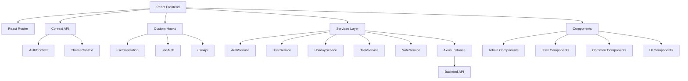

# Workplace Tracker UI

A comprehensive **React TypeScript** frontend application for the **Workplace Tracker** system, providing an intuitive interface for employee management, attendance tracking, leave management, holiday tracking, task management, and administrative operations.

---

## **📝 Last Updated: `2025-09-17`**

## Table of Contents

- [Workplace Tracker UI](#workplace-tracker-ui)
  - [**📝 Last Updated: `September 15, 2025`**](#-last-updated-september-15-2025)
  - [Table of Contents](#table-of-contents)
  - [🎯 Overview](#-overview)
  - [✨ Key Features](#-key-features)
  - [🏗️ System Architecture](#️-system-architecture)
  - [🚀 Tech Stack](#-tech-stack)
  - [📋 Prerequisites](#-prerequisites)
  - [⚡ Quick Start](#-quick-start)
  - [🏗️ Project Structure](#️-project-structure)
  - [🔧 Configuration](#-configuration)
  - [🌐 Internationalization (i18n)](#-internationalization-i18n)
  - [🔐 Authentication & Authorization](#-authentication--authorization)
  - [📊 Dashboard Features](#-dashboard-features)
  - [🎨 UI Components & Styling](#-ui-components--styling)
  - [🌙 Theme System](#-theme-system)
  - [🔌 API Integration](#-api-integration)
  - [🛠️ Available Scripts](#️-available-scripts)
  - [📁 Component Architecture](#-component-architecture)
  - [📱 Responsive Design](#-responsive-design)
  - [⚡ Performance Features](#-performance-features)
  - [🚀 Deployment](#-deployment)
  - [🧪 Testing](#-testing)
  - [🔍 Troubleshooting](#-troubleshooting)
  - [🤝 Contributing](#-contributing)
  - [📄 License](#-license)

---

## 🎯 Overview

The **Workplace Tracker UI** is a modern, feature-rich React application built with TypeScript that serves as the frontend for a comprehensive workplace management system. It provides role-based dashboards and functionality for both users and administrators to manage various aspects of workplace operations.

### Core Capabilities:
- **User Management** - Complete employee lifecycle management
- **Attendance Tracking** - Office visits, remote work, and analytics
- **Leave Management** - Policy management, leave applications, and approvals
- **Holiday Management** - Company-wide holiday tracking and management
- **Task Management** - Personal and team task organization
- **Notes Management** - Personal note-taking with smart features
- **Analytics & Reporting** - Comprehensive insights and reports
- **Multi-language Support** - Full internationalization with 4 languages

---

## ✨ Key Features

### 🔐 **Authentication & Security**
- **JWT-based Authentication** with automatic token refresh
- **Role-based Access Control** (USER/ADMIN roles)
- **Account Lock Protection** with login attempt tracking
- **Last Login Tracking** with popup notifications
- **Secure Password Reset** functionality
- **Session Management** with automatic logout

### 📊 **Dashboard & Analytics**
- **Role-specific Dashboards** - Tailored for Users and Admins
- **Interactive Cards** - Quick access to all features
- **Real-time Data** - Live updates and notifications
- **Office Visit Analytics** - Comprehensive attendance insights
- **User Analytics Charts** - Visual data representation
- **Responsive Charts** - Built with Recharts library

### 👥 **User Management** (Admin)
- **Complete User Lifecycle** - Create, edit, delete users
- **Account Status Management** - Lock/unlock user accounts
- **Role Assignment** - Flexible role-based permissions
- **Login Attempts Monitoring** - Security insights
- **User Profile Management** - Comprehensive user information

### 🏢 **Attendance & Office Visits**
- **Office Visit Tracking** - Log office attendance
- **Remote Work Logging** - Track work-from-home days
- **Visit Analytics** - Detailed attendance insights
- **Calendar Integration** - Visual attendance calendar
- **Historical Data** - Complete attendance history

### 🏖️ **Leave & Holiday Management**
- **Leave Policy Management** - Flexible policy configuration
- **Leave Applications** - User-friendly leave requests
- **Holiday Calendar** - Company-wide holiday management
- **Leave Balance Tracking** - Real-time balance updates
- **Approval Workflows** - Streamlined approval processes

### 📝 **Task & Notes Management**
- **Smart Task Management** - Advanced task organization
- **Personal Notes** - Feature-rich note-taking
- **Search & Filter** - Powerful content discovery
- **Category Organization** - Structured content management
- **Priority Management** - Task prioritization

### 🌐 **Internationalization**
- **4 Language Support** - English, Spanish, French, Hindi
- **Dynamic Language Switching** - Runtime language changes
- **Authentication-Aware Language Management** - User-specific language preferences
- **Automatic Language Restoration** - Saved preferences restored on login
- **Localized Content** - Full UI translation
- **Cultural Adaptation** - Locale-specific formatting
- **Fallback System** - Robust translation fallbacks

### 🎨 **Modern UI/UX**
- **Responsive Design** - Mobile-first approach
- **Dark/Light Themes** - System preference detection
- **Bootstrap 5** - Professional styling framework
- **Custom Animations** - Smooth transitions and effects
- **Glassmorphism Effects** - Modern visual aesthetics
- **Accessibility** - WCAG compliant components
- **Component Organization** - Well-structured component architecture
- **Centralized Routing** - Constants-based route management

---

## 🏗️ System Architecture



---

## Recent Improvements

### Component Organization (Latest)
- **Routing Components**: Moved `PrivateRoute.tsx` to `src/components/routing/` following React best practices
- **Form Components**: Organized `RoleSelect.tsx` in `src/components/forms/` for better maintainability  
- **Barrel Exports**: Implemented clean import patterns with index.ts files in component folders
- **Import Path Updates**: Updated all component imports to use new organized structure

### Authentication-Aware Language Management
- **Smart Language Persistence**: Language preferences are now tied to user authentication state
- **Secure Language Storage**: Authenticated users' language choices persist across sessions
- **Anonymous User Handling**: Guest users get session-based language selection with automatic cleanup
- **Improved UX**: Seamless language switching experience for both authenticated and anonymous users

### UI/UX Enhancements
- **Modern Navigation**: Updated routing structure with better organization and maintainability
- **Enhanced Error Handling**: Improved error boundaries and user feedback mechanisms
- **Responsive Design**: Better mobile and desktop experience across all components

## 🚀 Getting Started

### **Core Technologies**
- **React 19.1.1** - Modern React with latest features
- **TypeScript 4.9.5** - Type-safe development
- **React Router DOM 7.8.2** - Advanced routing and navigation
- **React Scripts 5.0.1** - Build tooling and development server

### **State Management & Context**
- **React Context API** - Global state management
- **Custom Hooks** - Reusable stateful logic
- **Local Storage** - Persistent user preferences

### **UI & Styling**
- **Bootstrap 5.3.8** - Responsive CSS framework
- **Bootstrap Icons 1.13.1** - Comprehensive icon library
- **Custom CSS** - Advanced styling with glassmorphism effects
- **CSS Variables** - Dynamic theming system

### **HTTP & API**
- **Axios 1.12.1** - Promise-based HTTP client
- **Interceptors** - Automatic token injection and error handling
- **Request/Response Transformation** - Data normalization

### **Charts & Visualization**
- **Recharts 3.1.2** - Powerful charting library
- **Responsive Charts** - Mobile-friendly visualizations

### **Utilities & Helpers**
- **date-fns 4.1.0** - Modern date utility library
- **React Toastify 11.0.5** - Elegant notification system
- **Custom Utilities** - Date formatting, validation, storage helpers

### **Development & Testing**
- **Jest & React Testing Library** - Comprehensive testing suite
- **TypeScript ESLint** - Code quality and consistency
- **VS Code Integration** - Optimized development experience

---

## 📋 Prerequisites

### **System Requirements**
- **Node.js 18.0.0+** - JavaScript runtime
- **npm 8.0.0+** or **yarn 1.22.0+** - Package manager
- **Git** - Version control system

### **Backend Dependencies**
- **workplace-tracker-service** - Running backend API server
- **Database** - Backend database connectivity
- **CORS Configuration** - Properly configured cross-origin requests

### **Development Environment**
- **VS Code** (recommended) - With TypeScript and React extensions
- **Chrome DevTools** - For debugging and performance analysis
- **Modern Browser** - Chrome 90+, Firefox 88+, Safari 14+, Edge 90+

---

## ⚡ Quick Start

### **1. Clone Repository**
```bash
git clone https://github.com/siddhantpatni0407/workplace-tracker-ui.git
cd workplace-tracker-ui
```

### **2. Install Dependencies**
```bash
# Using npm
npm install

# Using yarn
yarn install
```

### **3. Configure Environment**
Update `src/constants/apiEndpoints.ts` with your backend URL:
```typescript
const API_BASE_URL = "http://localhost:8010/api/v1/workplace-tracker-service";
```

### **4. Start Development Server**
```bash
npm start
# or
yarn start
```

### **5. Access Application**
Open [http://localhost:3000](http://localhost:3000) in your browser.

### **6. Default Login Credentials**
- **Admin**: Check with backend service for default admin credentials
- **User**: Register new user or check backend documentation

---

## 🏗️ Project Structure

```
workplace-tracker-ui/
├── public/                          # Static assets
│   ├── index.html                   # HTML template
│   ├── logo.png                     # Application logo
│   ├── manifest.json                # PWA manifest
│   └── robots.txt                   # SEO robots file
│
├── src/                             # Source code
│   ├── assets/                      # Static assets
│   │   ├── workplace-tracker-background.jpg
│   │   └── workplace-tracker.png
│   │
│   ├── components/                  # React components
│   │   ├── admin/                   # Admin-specific components
│   │   │   ├── dashboard/           # Admin dashboard
│   │   │   ├── holiday/             # Holiday management
│   │   │   ├── leavePolicyManagement/ # Leave policy management
│   │   │   ├── reports/             # Reports and analytics
│   │   │   └── userManagement/      # User management
│   │   │
│   │   ├── common/                  # Shared components
│   │   │   ├── about/               # About page
│   │   │   ├── contact/             # Contact page
│   │   │   ├── Footer/              # Footer component
│   │   │   ├── Header/              # Header component
│   │   │   ├── home/                # Home page
│   │   │   ├── language-selector/   # Language switcher
│   │   │   ├── login/               # Login component
│   │   │   ├── Navbar/              # Navigation bar
│   │   │   ├── signUp/              # Registration component
│   │   │   ├── theme/               # Theme switcher
│   │   │   ├── userProfile/         # User profile
│   │   │   └── userSettings/        # User settings
│   │   │
│   │   ├── forms/                   # Form-related components
│   │   │   ├── RoleSelect.tsx       # Role selection component
│   │   │   └── index.ts             # Form component exports
│   │   │
│   │   ├── routing/                 # Route-related components
│   │   │   ├── PrivateRoute.tsx     # Route protection component
│   │   │   └── index.ts             # Routing component exports
│   │   │
│   │   ├── ui/                      # Reusable UI components
│   │   │   ├── ErrorBoundary.tsx    # Error boundary
│   │   │   ├── ErrorMessage.tsx     # Error display
│   │   │   ├── LoadingSpinner.tsx   # Loading indicator
│   │   │   └── index.ts             # Component exports
│   │   │
│   │   ├── user/                    # User-specific components
│   │   │   ├── dashboard/           # User dashboard
│   │   │   ├── holiday/             # Holiday tracker
│   │   │   ├── leave/               # Leave application
│   │   │   ├── leavePolicy/         # Leave policy viewer
│   │   │   ├── notes/               # Notes management
│   │   │   ├── officeVisit/         # Office visit logging
│   │   │   ├── officeVisitAnalytics/ # Visit analytics
│   │   │   └── tasks/               # Task management
│   │   │
│   │   ├── index.ts                 # Main component exports
│   │   └── README.md                # Component architecture documentation
│   │
│   ├── constants/                   # Application constants
│   │   ├── apiEndpoints.ts          # API endpoint definitions
│   │   ├── userSettingsOptions.ts   # User settings options
│   │   └── ui/                      # UI constants
│   │
│   ├── context/                     # React contexts
│   │   └── AuthContext.tsx          # Authentication context
│   │
│   ├── enums/                       # TypeScript enums
│   │   ├── ApiEnums.ts              # API-related enums
│   │   ├── HolidayEnums.ts          # Holiday enums
│   │   ├── LeaveEnums.ts            # Leave enums
│   │   ├── OfficeVisitEnums.ts      # Office visit enums
│   │   ├── UserEnums.ts             # User enums
│   │   └── index.ts                 # Enum exports
│   │
│   ├── hooks/                       # Custom React hooks
│   │   ├── useApi.ts                # API interaction hook
│   │   ├── useDebounce.ts           # Debounce hook
│   │   ├── useForm.ts               # Form management hook
│   │   ├── useLocalStorage.ts       # Local storage hook
│   │   ├── useTranslation.ts        # Translation hook
│   │   └── index.ts                 # Hook exports
│   │
│   ├── locales/                     # Internationalization files
│   │   ├── en_US_message.json       # English translations
│   │   ├── es_ES_message.json       # Spanish translations
│   │   ├── fr_FR_message.json       # French translations
│   │   └── hi_IN_message.json       # Hindi translations
│   │
│   ├── models/                      # TypeScript models
│   │   ├── Api.ts                   # API models
│   │   ├── Form.ts                  # Form models
│   │   ├── Holiday.ts               # Holiday models
│   │   ├── Leave.ts                 # Leave models
│   │   ├── OfficeVisit.ts           # Office visit models
│   │   ├── User.ts                  # User models
│   │   └── index.ts                 # Model exports
│   │
│   ├── pages/                       # Page components
│   │   ├── NotFound.tsx             # 404 page
│   │   └── not-found.css            # 404 page styles
│   │
│   ├── services/                    # API services
│   │   ├── authService.ts           # Authentication service
│   │   ├── axiosInstance.ts         # Axios configuration
│   │   ├── holidayService.ts        # Holiday service
│   │   ├── leavePolicyService.ts    # Leave policy service
│   │   ├── noteService.ts           # Notes service
│   │   ├── taskService.ts           # Task service
│   │   └── userService.ts           # User service
│   │
│   ├── styles/                      # Global styles
│   │   └── global.css               # Global CSS variables and themes
│   │
│   ├── theme/                       # Theme system
│   │   └── ThemeContext.js          # Theme context provider
│   │
│   ├── types/                       # TypeScript type definitions
│   │   ├── api.ts                   # API types
│   │   ├── auth.ts                  # Authentication types
│   │   ├── holiday.ts               # Holiday types
│   │   └── leavePolicy.ts           # Leave policy types
│   │
│   ├── utils/                       # Utility functions
│   │   ├── date.ts                  # Date utilities
│   │   ├── format.ts                # Formatting utilities
│   │   ├── storage.ts               # Storage utilities
│   │   ├── validation.ts            # Validation utilities
│   │   └── index.ts                 # Utility exports
│   │
│   ├── App.tsx                      # Main App component
│   ├── App.css                      # App-specific styles
│   ├── i18n.ts                      # i18n configuration
│   ├── index.tsx                    # App entry point
│   ├── index.css                    # Global styles
│   └── react-app-env.d.ts           # React type definitions
│
├── Dockerfile                       # Docker configuration
├── package.json                     # Package configuration
├── tsconfig.json                    # TypeScript configuration
└── README.md                        # Project documentation
```

---

## 🔧 Configuration

### **Environment Configuration**
The application uses a centralized configuration approach:

```typescript
// src/constants/apiEndpoints.ts
const API_BASE_URL = "http://localhost:8010/api/v1/workplace-tracker-service";

export const API_ENDPOINTS = {
  AUTH: {
    SIGNUP: `${API_BASE_URL}/register`,
    LOGIN: `${API_BASE_URL}/login`,
    LOGOUT: `${API_BASE_URL}/logout`,
    REFRESH_TOKEN: `${API_BASE_URL}/auth/refresh`,
  },
  USERS: {
    GET_ALL: `${API_BASE_URL}/user/fetch`,
    CREATE: `${API_BASE_URL}/user`,
    UPDATE: (id: string) => `${API_BASE_URL}/user/${id}`,
  },
  // ... more endpoints
};
```

### **Axios Configuration**
HTTP client with automatic token injection:

```typescript
// src/services/axiosInstance.ts
const axiosInstance = axios.create({
  baseURL: API_BASE_URL,
  timeout: 15000,
  headers: {
    'Content-Type': 'application/json',
  },
});

// Request interceptor for token injection
axiosInstance.interceptors.request.use((config) => {
  const token = localStorage.getItem('auth_token');
  if (token) {
    config.headers.Authorization = `Bearer ${token}`;
  }
  return config;
});
```

### **Local Storage Keys**
Centralized storage key management:

```typescript
const STORAGE_KEYS = {
  USER: 'workplace_tracker_user',
  TOKEN: 'workplace_tracker_token',
  REFRESH_TOKEN: 'workplace_tracker_refresh_token',
  THEME: 'app-theme',
  LANGUAGE: 'i18nextLng'
};
```

---

## 🌐 Internationalization (i18n)

### **Supported Languages**
- **English (en)** - Default language
- **Spanish (es)** - Full translation
- **French (fr)** - Complete localization
- **Hindi (hi)** - Unicode support with Devanagari fonts

### **Translation Structure**
```json
{
  "common": {
    "save": "Save",
    "cancel": "Cancel",
    "loading": "Loading..."
  },
  "navigation": {
    "home": "Home",
    "dashboard": "Dashboard",
    "settings": "Settings"
  },
  "dashboard": {
    "userDashboard": {
      "title": "User Dashboard",
      "cards": {
        "tasks": {
          "title": "Tasks",
          "subtitle": "Manage your daily tasks"
        }
      }
    }
  }
}
```

### **Usage in Components**
```typescript
import { useTranslation } from '../hooks/useTranslation';

const MyComponent = () => {
  const { t } = useTranslation();
  
  return (
    <div>
      <h1>{t('dashboard.userDashboard.title')}</h1>
      <p>{t('common.loading')}</p>
    </div>
  );
};
```

### **Language Switching**
Dynamic language switching with persistence:

```typescript
const { changeLanguage, language } = useTranslation();

const handleLanguageChange = (newLanguage: string) => {
  changeLanguage(newLanguage);
  // Language preference is automatically saved to localStorage
};
```

---

## 🔐 Authentication & Authorization

### **Authentication Flow**
1. **Login** - User submits credentials
2. **Token Generation** - Backend issues JWT tokens
3. **Token Storage** - Secure storage in localStorage
4. **Automatic Injection** - Axios interceptor adds tokens to requests
5. **Token Refresh** - Automatic refresh on expiration
6. **Logout** - Clean token removal and redirect

### **Role-Based Access Control**
```typescript
// Protected route with role restriction
<PrivateRoute role="ADMIN">
  <AdminDashboard />
</PrivateRoute>

// Multiple roles allowed
<PrivateRoute role={["ADMIN", "USER"]}>
  <SharedComponent />
</PrivateRoute>

// Any authenticated user
<PrivateRoute>
  <UserProfile />
</PrivateRoute>
```

### **Auth Context**
Centralized authentication state management:

```typescript
interface AuthContextType {
  user: User | null;
  isAuthenticated: boolean;
  login: (email: string, password: string) => Promise<AuthResponse>;
  logout: () => void;
  updateUser: (updates: Partial<User>) => void;
  isLoading: boolean;
}
```

### **Security Features**
- **JWT Token Management** - Secure token handling
- **Account Lockout Protection** - Prevents brute force attacks
- **Session Timeout** - Automatic logout on inactivity
- **CSRF Protection** - Secure request handling
- **Password Validation** - Strong password requirements

---

## 📊 Dashboard Features

### **User Dashboard**
The user dashboard provides quick access to daily operations:

#### **Available Cards:**
1. **Tasks** - Personal task management
2. **Office Visit** - Log office attendance
3. **Office Visit Analytics** - View attendance insights
4. **Holiday Tracker** - Track company holidays
5. **Leave Policy** - View leave policies
6. **Apply Leave** - Submit leave requests
7. **Notes** - Personal note management

### **Admin Dashboard**
Comprehensive administrative controls:

#### **Admin Cards:**
1. **User Management** - Complete user lifecycle management
2. **Holiday Management** - Company holiday configuration
3. **Leave Policy Management** - Policy administration
4. **Reports** - Analytics and insights
5. **User Analytics** - Detailed user statistics
6. **Database Management** - System administration

### **Dashboard Architecture**
```typescript
interface DashboardCard {
  id: string;
  title: string;
  subtitle: string;
  icon: string;
  colorClass: string;
  route: string;
  roles?: UserRole[];
}

// Dynamic card configuration with translations
const cards = useMemo<DashboardCard[]>(() => [
  {
    id: "tasks",
    title: t('dashboard.userDashboard.cards.tasks.title'),
    subtitle: t('dashboard.userDashboard.cards.tasks.subtitle'),
    icon: "bi-list-task",
    colorClass: "card-blue",
    route: "/user-tasks",
  },
  // ... more cards
], [t]); // Re-compute when translations change
```

---

## 🎨 UI Components & Styling

### **Design System**
- **Bootstrap 5.3.8** - Responsive grid and components
- **Bootstrap Icons 1.13.1** - Comprehensive icon library
- **Custom CSS Variables** - Dynamic theming support
- **Glassmorphism Effects** - Modern visual aesthetics

### **Component Categories**

#### **UI Components** (`src/components/ui/`)
- **ErrorBoundary** - React error boundary wrapper
- **LoadingSpinner** - Animated loading indicators
- **ErrorMessage** - Styled error displays

#### **Common Components** (`src/components/common/`)
- **Header** - App header with user info
- **Navbar** - Responsive navigation
- **Footer** - App footer with links
- **LanguageSelector** - Language switching component

#### **Feature Components**
- **Form Components** - Reusable form elements
- **Data Tables** - Advanced table with sorting/filtering
- **Charts** - Analytics visualization components
- **Modals** - Dialog and popup components

### **Styling Architecture**
```css
/* Global theme variables */
:root {
  --bg: #ffffff;
  --text: #111111;
  --card: #f8fafc;
  --accent: #2563eb;
  --nav-gradient-start: #4a00e0;
  --nav-gradient-end: #8e2de2;
}

/* Dark theme overrides */
[data-theme="dark"] {
  --bg: #111111;
  --text: #ffffff;
  --card: #1f1f23;
  --accent: #3b82f6;
}
```

---

## 🌙 Theme System

### **Theme Options**
- **Light Theme** - Default clean appearance
- **Dark Theme** - Eye-friendly dark mode
- **System Theme** - Automatic based on system preference

### **Theme Implementation**
```typescript
// Theme context provider
export const ThemeProvider = ({ children }) => {
  const [theme, setTheme] = useState("system");
  
  const effectiveTheme = theme === "system" 
    ? getSystemTheme() 
    : theme;
    
  useEffect(() => {
    document.documentElement.setAttribute("data-theme", effectiveTheme);
  }, [effectiveTheme]);
  
  return (
    <ThemeContext.Provider value={{ theme, setTheme, effectiveTheme }}>
      {children}
    </ThemeContext.Provider>
  );
};
```

### **System Preference Detection**
```typescript
const getSystemTheme = () =>
  window.matchMedia("(prefers-color-scheme: dark)").matches
    ? "dark"
    : "light";
```

---

## 🔌 API Integration

### **Service Layer Architecture**
Each domain has its dedicated service:

#### **Authentication Service** (`authService.ts`)
```typescript
export const authService = {
  login: (credentials: LoginCredentials) => Promise<AuthResponse>,
  signup: (userData: SignupData) => Promise<AuthResponse>,
  logout: () => Promise<void>,
  refreshToken: () => Promise<AuthResponse>,
};
```

#### **User Service** (`userService.ts`)
```typescript
export const userService = {
  getUsers: (params?: UserQueryParams) => Promise<User[]>,
  createUser: (userData: CreateUserRequest) => Promise<User>,
  updateUser: (id: string, userData: UpdateUserRequest) => Promise<User>,
  deleteUser: (id: string) => Promise<void>,
};
```

### **API Response Handling**
Standardized response format:
```typescript
interface ResponseDTO<T> {
  status: "SUCCESS" | "FAILED";
  message?: string;
  data?: T;
  error?: string;
}
```

### **Error Handling**
Centralized error handling with user-friendly messages:
```typescript
axiosInstance.interceptors.response.use(
  (response) => response,
  (error) => {
    if (error.response?.status === 401) {
      // Handle authentication errors
      authService.logout();
      window.location.href = '/login';
    }
    return Promise.reject(error);
  }
);
```

---

## 🛠️ Available Scripts

### **Development Scripts**
```bash
# Start development server
npm start

# Build production bundle
npm run build

# Run test suite
npm test

# Run tests with coverage
npm run test:coverage

# Lint code
npm run lint

# Fix linting issues
npm run lint:fix

# Type check
npm run type-check
```

### **Docker Scripts**
```bash
# Build Docker image
docker build -t workplace-tracker-ui .

# Run containerized app
docker run -p 3000:80 workplace-tracker-ui
```

---

## 📁 Component Architecture

### **Component Patterns**

#### **Lazy Loading**
All route components are lazy-loaded for optimal performance:
```typescript
const AdminDashboard = lazy(() => import("./components/admin/dashboard/AdminDashboard"));
const UserDashboard = lazy(() => import("./components/user/dashboard/UserDashboard"));
```

#### **Error Boundaries**
Comprehensive error handling:
```typescript
<ErrorBoundary>
  <Suspense fallback={<LoadingSpinner />}>
    <Dashboard />
  </Suspense>
</ErrorBoundary>
```

#### **Memoization**
Performance optimization with React.memo and useMemo:
```typescript
const Dashboard = memo(() => {
  const cards = useMemo(() => generateCards(), [dependencies]);
  return <DashboardLayout cards={cards} />;
});
```

### **Custom Hooks**

#### **useApi Hook**
```typescript
const useApi = <T>(apiCall: () => Promise<T>) => {
  const [data, setData] = useState<T | null>(null);
  const [loading, setLoading] = useState(false);
  const [error, setError] = useState<string | null>(null);
  
  const execute = useCallback(async () => {
    setLoading(true);
    try {
      const result = await apiCall();
      setData(result);
    } catch (err) {
      setError(err.message);
    } finally {
      setLoading(false);
    }
  }, [apiCall]);
  
  return { data, loading, error, execute };
};
```

#### **useForm Hook**
```typescript
const useForm = <T>(initialValues: T, validationSchema?: any) => {
  const [values, setValues] = useState<T>(initialValues);
  const [errors, setErrors] = useState<Record<string, string>>({});
  
  const handleChange = (name: keyof T, value: any) => {
    setValues(prev => ({ ...prev, [name]: value }));
    // Clear error when user starts typing
    if (errors[name as string]) {
      setErrors(prev => ({ ...prev, [name]: undefined }));
    }
  };
  
  return { values, errors, handleChange, validate, reset };
};
```

---

## 📱 Responsive Design

### **Breakpoint Strategy**
```css
/* Mobile-first responsive design */
.dashboard-card {
  width: 100%;
  margin-bottom: 1rem;
}

@media (min-width: 576px) {
  .dashboard-card {
    width: calc(50% - 0.5rem);
  }
}

@media (min-width: 992px) {
  .dashboard-card {
    width: calc(33.333% - 0.75rem);
  }
}

@media (min-width: 1200px) {
  .dashboard-card {
    width: calc(25% - 0.75rem);
  }
}
```

### **Mobile Optimization**
- **Touch-friendly UI** - Optimized touch targets
- **Responsive Tables** - Horizontal scroll on mobile
- **Collapsible Navigation** - Mobile-friendly menu
- **Optimized Forms** - Mobile keyboard support

---

## ⚡ Performance Features

### **Code Splitting**
- **Route-based splitting** - Lazy-loaded pages
- **Component-level splitting** - Dynamic imports
- **Vendor chunk splitting** - Optimized bundle sizes

### **Memoization Strategy**
- **React.memo** - Component memoization
- **useMemo** - Expensive computations
- **useCallback** - Function reference stability

### **Bundle Optimization**
- **Tree shaking** - Dead code elimination
- **Minification** - Compressed production builds
- **Gzip compression** - Reduced transfer sizes

### **Performance Monitoring**
```typescript
// Web Vitals reporting
import { reportWebVitals } from './reportWebVitals';

reportWebVitals(console.log);
```

---

## 🚀 Deployment

### **Production Build**
```bash
npm run build
```

Creates optimized production build in `build/` folder:
- **Minified JS/CSS** - Compressed assets
- **Source maps** - Debugging support
- **Static assets** - Optimized images and fonts

### **Environment Configuration**
```bash
# Production environment variables
REACT_APP_API_BASE_URL=https://api.workplacetracker.com
REACT_APP_ENVIRONMENT=production
```

### **Docker Deployment**
```dockerfile
# Multi-stage build for optimized image
FROM node:18-alpine as builder
WORKDIR /app
COPY package*.json ./
RUN npm ci --only=production
COPY . .
RUN npm run build

FROM nginx:alpine
COPY --from=builder /app/build /usr/share/nginx/html
COPY nginx.conf /etc/nginx/nginx.conf
EXPOSE 80
CMD ["nginx", "-g", "daemon off;"]
```

### **Deployment Platforms**
- **Netlify** - Static site hosting with automatic deployments
- **Vercel** - Zero-config deployment with edge functions
- **AWS S3 + CloudFront** - Enterprise-grade hosting
- **Docker** - Containerized deployment

### **CI/CD Pipeline**
```yaml
# GitHub Actions example
name: Deploy to Production
on:
  push:
    branches: [main]
jobs:
  build-and-deploy:
    runs-on: ubuntu-latest
    steps:
      - uses: actions/checkout@v2
      - name: Setup Node.js
        uses: actions/setup-node@v2
        with:
          node-version: '18'
      - name: Install dependencies
        run: npm ci
      - name: Run tests
        run: npm test
      - name: Build application
        run: npm run build
      - name: Deploy to production
        run: npm run deploy
```

---

## 🧪 Testing

### **Testing Strategy**
- **Unit Tests** - Component and utility testing
- **Integration Tests** - API integration testing
- **E2E Tests** - User workflow testing

### **Testing Tools**
- **Jest** - Test runner and assertion library
- **React Testing Library** - Component testing utilities
- **MSW** - API mocking for tests

### **Test Examples**
```typescript
// Component testing
import { render, screen } from '@testing-library/react';
import { Dashboard } from './Dashboard';

test('renders dashboard cards', () => {
  render(<Dashboard />);
  expect(screen.getByText('User Management')).toBeInTheDocument();
});

// API service testing
import { authService } from '../services/authService';

test('login returns auth response', async () => {
  const response = await authService.login({
    email: 'test@example.com',
    password: 'password123'
  });
  
  expect(response.status).toBe('SUCCESS');
  expect(response.token).toBeDefined();
});
```

---

## 🔍 Troubleshooting

### **Common Issues & Solutions**

#### **Authentication Issues**
```bash
# Problem: 401 Unauthorized errors
# Solution: Check token expiration and refresh logic
localStorage.getItem('auth_token') // Verify token exists
// Check network tab for token in Authorization header
```

#### **CORS Issues**
```bash
# Problem: Cross-origin request blocked
# Solution: Configure backend CORS settings
# Add to backend: @CrossOrigin(origins = "http://localhost:3000")
```

#### **Build Issues**
```bash
# Problem: Build fails with TypeScript errors
# Solution: Fix type errors or temporarily bypass
npm run build -- --skip-type-check

# Problem: Out of memory during build
# Solution: Increase Node.js memory limit
NODE_OPTIONS="--max-old-space-size=4096" npm run build
```

#### **Performance Issues**
```bash
# Problem: Slow initial load
# Solution: Analyze bundle size
npm install -g webpack-bundle-analyzer
npx webpack-bundle-analyzer build/static/js/*.js
```

#### **Translation Issues**
```bash
# Problem: Missing translations
# Solution: Check translation keys in JSON files
# Verify useTranslation hook is properly imported
```

### **Debug Tools**
- **React Developer Tools** - Component debugging
- **Redux DevTools** - State inspection (if using Redux)
- **Network Tab** - API request debugging
- **Console Logs** - Runtime debugging

---

## 🤝 Contributing

### **Development Workflow**
1. **Fork Repository** - Create personal copy
2. **Create Feature Branch** - `git checkout -b feature/amazing-feature`
3. **Commit Changes** - Use conventional commits
4. **Push Branch** - `git push origin feature/amazing-feature`
5. **Create Pull Request** - Submit for review

### **Code Standards**
- **TypeScript** - Strict type checking
- **ESLint** - Code quality rules
- **Prettier** - Code formatting
- **Conventional Commits** - Standardized commit messages

### **Commit Message Format**
```bash
feat: add user notification system
fix: resolve authentication timeout issue
docs: update API documentation
style: improve button hover effects
refactor: optimize dashboard rendering
test: add unit tests for auth service
```

### **Pull Request Guidelines**
- **Clear Description** - Explain changes and motivation
- **Test Coverage** - Include relevant tests
- **Documentation Updates** - Update README if needed
- **Breaking Changes** - Highlight any breaking changes

---

## 📄 License

This project is licensed under the **MIT License** - see the [LICENSE](LICENSE) file for details.

### **MIT License Summary**
- ✅ **Commercial Use** - Use in commercial projects
- ✅ **Modification** - Modify and distribute
- ✅ **Distribution** - Share with others
- ✅ **Private Use** - Use privately
- ❗ **Liability** - No warranty provided
- ❗ **Attribution** - Include license notice

---

**Built with ❤️ by [Siddhant Patni](https://github.com/siddhantpatni0407)**

*Last Updated: September 15, 2025*
